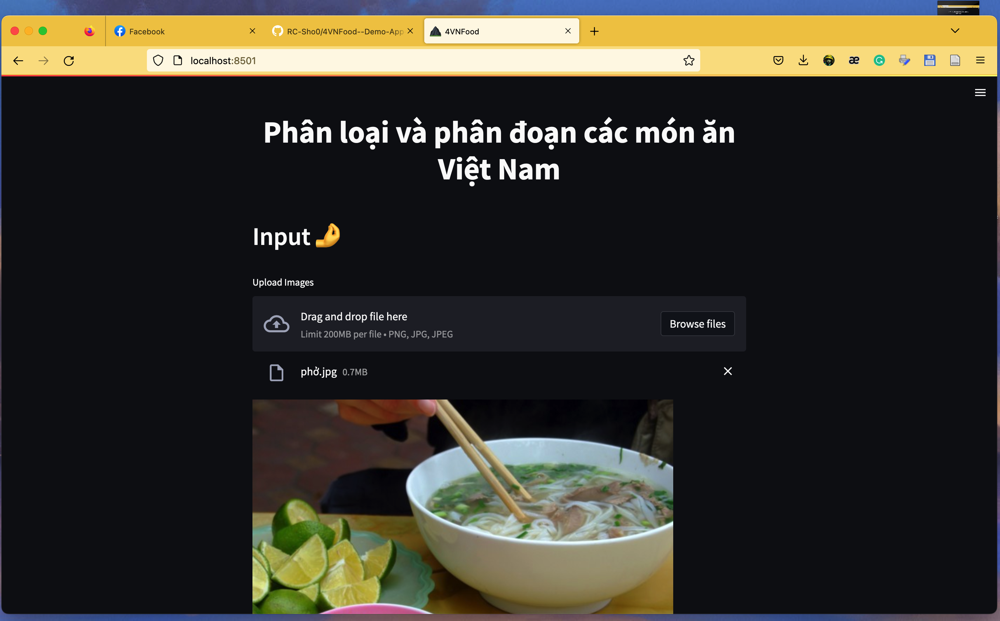
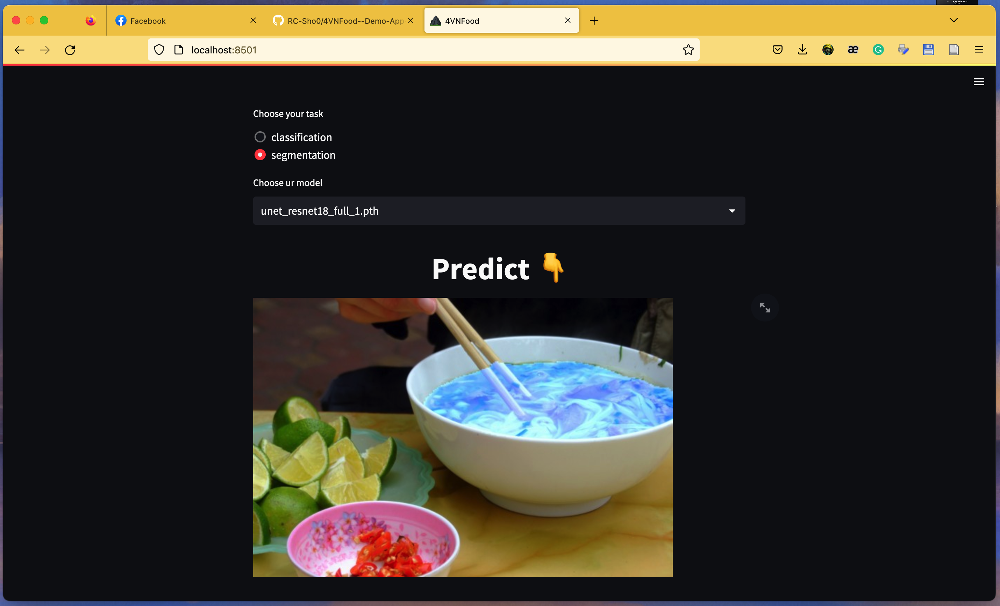

# 4VNFood--Demo-App-by-Streamlit

### This is my course project of DeepLearning
### Our topic is Classification and Segmentation in 4 Vietnamese Food
### ⛔️ Attention: This repo is part 2 of our project. This one only have source code of Demo App. 
### 👉 Please follow this link to get part1: 


## What is it?
This is our demo application for that topic. I was use Streamlit to build it. Really easy to read 🫰.

This is the interface of the software.





## How to use?
### 1. First use need to clone this repo:
```
git clone https://github.com/RC-Sho0/4VNFood--Demo-App-by-Streamlit.git
```
### 2. Download trained file:
- Follow the link and download trained folder
```
https://sthuflitedu-my.sharepoint.com/:f:/g/personal/19dh110660_st_huflit_edu_vn/Eps3QYb6c6ZGo4sT5m5Xmo4Bz_tXrTEtyGltmbrt5-36wg?e=KddZIt
```

- After downloaded you need to move that folder to folder clone
  
### 3. Launch
```
streamlit run app.py
```

### 4. Open your brower and enjoy
- Open port 8051:
  ```
  http://localhost:8501/
  ```


-----------
Code by Sho0


